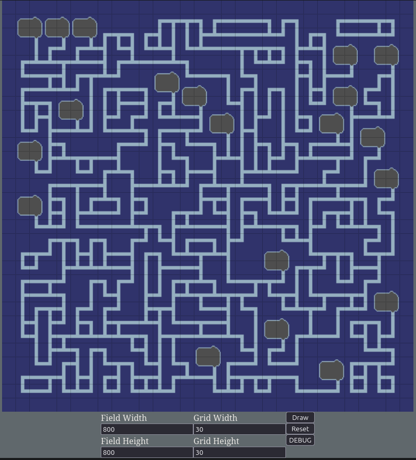

# Wave Function Collapse – Simple Web Demo

This project is a minimal web-based implementation of the **Wave Function Collapse (WFC)** algorithm.

It demonstrates constraint-based procedural generation using a small set of static image tiles. The goal of this project is purely for my own understanding of the algorithem and perhaps as a reference in the future.

---

## Overview

The page renders a grid where:

- Each cell represents a superposition of possible tiles  
- Constraints are propagated between neighboring cells  
- The grid collapses step by step until a valid configuration is found  

The tiles used are static test images. This is only a proof-of-concept.

---

## Screenshot



---

## Features

- Adjustable grid width and height  
- Adjustable field dimensions  
- Draw and reset controls  
- Debug mode for development inspection  

## Usage

1. Install the required Python dependencies:

    ```bash
    pip install -r requirements.txt
    ```

2. (Optional) Change the port in `app.py` if needed.

3. Run the application:

    ```bash
    python3 app.py
    ```

4. Open your browser and navigate to:

    ```http://localhost:<PORT>```

Replace `<PORT>` with the value defined in `app.py`.